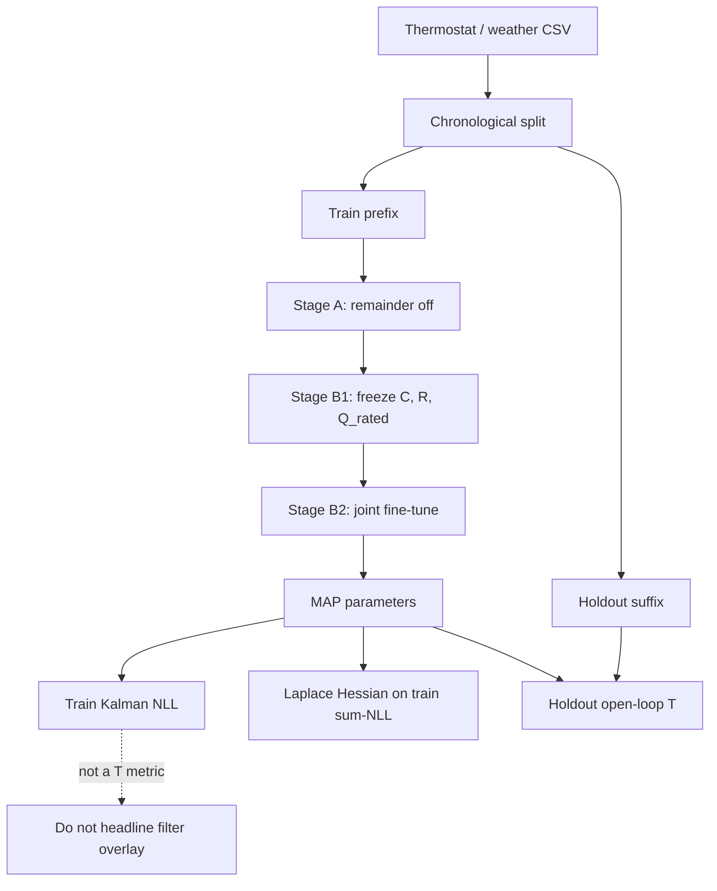

# Framework

This page describes how the equations in [mathematical models](mathematical-models.md) are fitted in JAX: no leakage, two-stage MAP, holdout open-loop $T$, train-only Laplace UQ, and CSV I/O.

## Architecture



Indoor $T$ is already measured, so a Kalman mean that tracks the thermostat series is **not** reported as accuracy.

## Package layout

```
src/pi_nsde_building_thermal/
  physics.py     energy balance, humidity, UA_eff
  sde.py         EM maps, interval-average Kalman, open-loop
  model.py       PhysRaw, remainder nets, penalties
  train.py       TrainConfig, two-stage MAP, identify_building
  uq.py          joint Laplace on train
  io.py          CSV aliases, checkpoint pickle
  synthetic.py   digital twin (eval truth only)
  example.py     package demo CLI
examples/        generate / train / infer CSV
tests/           leakage, unknown-Q_rated kW unused, UQ shapes
```

Entry points:

| Call | Role |
| --- | --- |
| `identify_building(arrays, TrainConfig, holdout_days=2)` | Split + fit + holdout open-loop |
| `quantify_uncertainty(...)` | Laplace on **train** only |
| `load_timeseries_csv` / `save_checkpoint` | Custom files |
| `python -m pi_nsde_building_thermal.example --q-rated unknown` | Full demo |

## No-leakage protocol

One contiguous series is cut **chronologically**: prefix = train, suffix = holdout. Default: last **2 of 7** days ($1440$ train intervals, $576$ holdout at $`5\,\mathrm{min}`$). Shorter series fall back to the last $`30\%`$.

| Rule | Implementation |
| --- | --- |
| No shuffle | `chronological_split` only |
| Fit on train | Holdout never enters NLL, remainder features, Fourier $`\mu_q`$, or noise |
| Causal features | Weather, HVAC channel, clock at interval $k$. No future rows. No indoor $T$ as a remainder input |
| Hidden occupancy | `q_int_kw_hidden` ignored even if present |
| True parameters | Evaluation only on the digital twin |
| Unknown capacity | `q_hvac_kw` is not read in the filter, remainder, or holdout HVAC channel |

Tests scramble `q_hvac_kw` with `on_frac` fixed: unknown-mode NLL is unchanged. Scrambling `hvac_on_frac` changes NLL, which is the expected contrast.

## Two-stage MAP

A remainder that is free while $C$ and $R$ move can absorb envelope and capacity. Training on the train prefix is therefore staged:

1. **Stage A** ($1800$ steps, remainder gate $0$): fit $`\{C,R,Q_{\mathrm{rated}}\text{ (if unknown)},A_s,\beta,\sigma_T,\sigma_q,\sigma_y,\kappa,\mu\}`$.
2. **Stage B1** ($300$ steps, smaller LR, stronger identifiability penalty): remainder on; **freeze** $C$, $R$, and $`Q_{\mathrm{rated}}`$.
3. **Stage B2** ($1400$ steps): joint fine-tune with the same penalty. In **known**-kW mode, $`Q_{\mathrm{rated}}`$ stays frozen (unused).

Optimizer: Adam with global-norm clip $5$. Feature mean/std are computed on the **train** slice only.

Trainer loss (mean interval NLL, optimizer scale):

```math
J_{\mathrm{mean}}
=
\frac{1}{N}\sum_k \ell_k
+ \lambda_{\mathrm{id}}\,\mathcal{P}_{\mathrm{id}}
+ \lambda_{\mathrm{prior}}\,\mathcal{P}_{C,R,Q,A_s}
+ \lambda_{\mathrm{occ}}\,\mathcal{P}_\mu.
```

Defaults: $`\lambda_{\mathrm{id}}=0.15`$ (A), $`0.45`$ (B); $`\lambda_{\mathrm{prior}}=0.002`$; $`\lambda_{\mathrm{occ}}=0.05`$.

Laplace uses the **sum** $`N\cdot J_{\mathrm{mean}}`$ (same critical point; Hessian is observed-information scale, not $`\mathrm{mean}/N`$).

## Holdout metric

Start from the last **train** filter state $`(T,Q_{\mathrm{int}})`$. Roll out interval-average $T$ on the holdout suffix with holdout weather and:

- unknown mode: $`\hat Q_{\mathrm{rated}}\,u^{\mathrm{holdout}}`$
- known mode: holdout `q_hvac_kw`

Holdout $T$ is compared **after** the rollout. It is not used in a Kalman update. Report RMSE / MAE in kelvin. A secondary number is train mean Kalman NLL (likelihood quality, not $T$ accuracy).

## Uncertainty quantification

`quantify_uncertainty` builds a finite-difference Hessian of the **train sum-NLL MAP** in unconstrained (`PhysRaw` + Fourier $`\mu_q`$) coordinates.

- Joint over $`\{C,R,Q_{\mathrm{rated}}\text{ (unknown mode)},A_s,\beta,\sigma_T,\sigma_q,\sigma_y,\kappa\}`$ and Fourier coefficients.
- Neural remainder / diffusion **weights stay at MAP** (not in the Hessian).
- Delta method back to positive units; 95% intervals. Filter bands on train $T$/$`Q_{\mathrm{int}}`$ are state uncertainty, not holdout accuracy.

Intervals **condition on neural weights at MAP**, so they can be overconfident and can sit around an aliased mode. They are not a substitute for sampling the nets.

## CSV I/O

Required (aliases accepted in `pi_nsde_building_thermal.io`):

- indoor temperature (`t_in_c`, `indoor_temp`, …)
- outdoor temperature (`t_out_c`, `outdoor_temp`, …)
- HVAC on/off (`hvac_on_frac`, `heating_on`, `cooling_on`, or `hvac_runtime_s`)
- `timestamp` or `t_hours`

Optional: GHI, RH, wind, setpoint, `hvac_kw` (known-kW protocol only; negative while cooling). Rows must already be chronological. Unsigned cooling runtime in a generic `hvac_on_frac` column needs `--hvac-mode cooling`.

```bash
python examples/generate_synthetic.py
python examples/train_csv.py output/synthetic_thermostat.csv --q-rated unknown
python examples/infer_csv.py output/synthetic_thermostat.csv output/checkpoint.pkl --mode holdout
```

Checkpoints are pickles of fitted `ModelParams` plus `TrainConfig` metadata (`save_checkpoint` / `load_checkpoint`).

## JAX stack

Parameters are fitted by automatic differentiation through the Kalman path likelihood (`jax.grad` / `optax`). The SDE is **not** a liquid neural net and **not** a deterministic PINN residual collocation. The closest classical stack is a gray-box RC-SDE with Kalman MLE (CTSM-style), plus an interval-average observation, optional unknown capacity, and a gated neural remainder.

Python 3.10+; see `pyproject.toml` for `jax`, `optax`, `numpy`, `pandas`, `matplotlib`.
